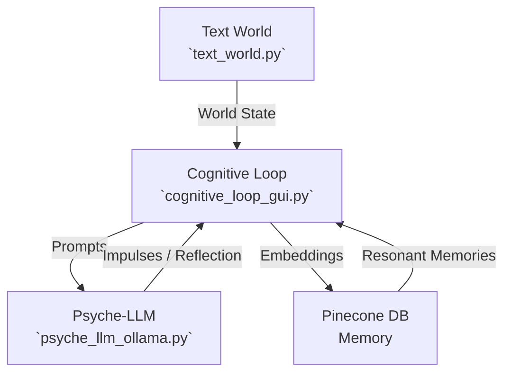
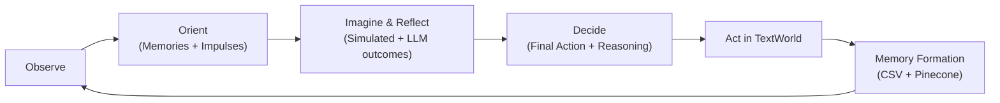

# Project Adam

Project Adam is a simulation designed to explore the principles of **emergent AI behavior**.
This README provides everything you need to **understand, install, run, and analyze** the project.

---

## 🚀 Quick Start

1. **Start the Psyche Service** (subconscious + imagination + reflection):

   ```bash
   python psyche_llm_ollama.py
   ```

2. **Start Adam’s Mind + GUI**:

   ```bash
   python cognitive_loop_gui.py
   ```

3. **Watch the GUI**:

   * See impulses → imagination → reflection → decision → action.
   * Observe hunger/stress change over time.
   * Track storyline threads and insights.

---

## 1. Introduction

Project Adam is a Python-based simulation of an **Emergent Behavior Agent (EBA)** named Adam.
Unlike traditional scripted NPCs, Adam’s actions are **not hard-coded**. Instead, his behavior emerges from:

* **Psychological drives** (hunger, mood, curiosity, etc.)
* **Subconscious impulses** generated by an LLM (Ollama)
* **Conscious reasoning** that balances impulses, emotions, and goals
* **Persistent memory** stored in a vector database (Pinecone)
* **Environmental events** from a text-based world (TextWorld)

The goal is to model **free-will-like behavior**, where Adam develops habits and personality traits organically over time.

---

## 2. Core Components

| Component                | File                    | Role                                                                             |
| ------------------------ | ----------------------- | -------------------------------------------------------------------------------- |
| **Text World**           | `text_world.py`         | Adam’s environment: a text-based apartment with rooms, objects, and events.      |
| **Psyche-LLM**           | `psyche_llm_ollama.py`  | Adam’s subconscious: generates impulses, imagination, and reflection via Ollama. |
| **Memory**               | Pinecone DB             | Stores Adam’s memories as embeddings for long-term recall.                       |
| **Cognitive Loop + GUI** | `cognitive_loop_gui.py` | Adam’s conscious mind: runs the OODA cycle, integrates memory, manages the GUI.  |

---

## 3. System Architecture

Adam’s cognition flows between world, psyche, memory, and actions:



---

## 4. Cognitive Loop (OODA Cycle)

Adam’s mind follows the **Observe → Orient → Decide → Act** cycle:



---

## 5. Setup and Installation

### Prerequisites

* Python **3.10+**
* [Ollama](https://ollama.ai/) installed locally
* Pinecone account (optional but recommended)

### Install dependencies

```bash
pip install -r requirements.txt
```

Dependencies:

* `flask`, `requests`, `python-dotenv`
* `sentence-transformers`
* `pinecone-client`
* `tkinter` (bundled with Python on most platforms)

### Configure Pinecone

1. Sign up at [pinecone.io](https://www.pinecone.io).

2. Create an index:

   | Setting        | Value                      |
   | -------------- | -------------------------- |
   | **Index Name** | `project-adam-memory-text` |
   | **Dimensions** | `384`                      |
   | **Metric**     | `cosine`                   |

3. Add credentials to `.env`:

   ```env
   PINECONE=<your_api_key>
   PINECONE_ENVIRONMENT=us-east-1
   ```

### Pull an Ollama model

```bash
ollama pull qwen3:1.7b
```

(You can also use `llama3`, `mistral`, etc.)

---

## 6. Running the Simulation

```bash
# Terminal 1: Start Psyche (LLM backend)
python psyche_llm_ollama.py

# Terminal 2: Start Adam’s Mind + GUI
python cognitive_loop_gui.py
```

---

## 7. World Simulation

Adam lives in a **virtual apartment** simulated by `TextWorld`:

* **Rooms**: living room, kitchen, bedroom, office
* **Objects**: phone, door, window, TV, radio, fridge, bed, book, computer, plant
* **Actions**: `wait`, `go`, `examine`, `open`, `close`, `read`, `eat`, `answer`, `toggle`, `sleep`, `water`
* **Events**:

  * Random: phone ringing, door knocking, TV static, radio music, computer error
  * Time: day/night cycle every 10 ticks
* **Needs**:

  * `hunger` rises over time → lowered by eating
  * `mood_intensity` rises with stress → lowered by calming actions (sleep, read, answer phone)

---

## 8. GUI Overview

Running `cognitive_loop_gui.py` opens the **Psyche Monitor**:

* **Vitals Panel**

  * Mood label + progress bar
  * Hunger progress bar (color-coded)
* **Mind Tabs**

  * *Insights*: causal chain, badges (frustration, loops, avoidance), story cards, storyline threads
  * *Subconscious*: impulses + emotional shift JSON
  * *Imagination*: predicted vs simulated outcomes
  * *Decision*: final action + reasoning
* **Live Log**

  * Adam’s narration + world events
* **Storyline Threads**

  * Tracks progress per object (e.g. door storyline, phone storyline)

---

## 9. Logs and Memory

* **CSV log** (`adam_behavior_log.csv`):
  Records each cycle with fields:

  ```
  timestamp, cycle_num, agent_id, world_time, location, mood, mood_intensity,
  sensory_events, resonant_memories, impulses, chosen_action, action_result,
  imagined_outcomes, simulated_outcomes, emotional_delta, kpis, snapshot
  ```

* **Pinecone memory**:
  Stores vector embeddings of memories, enabling recall of “resonant” past experiences.

---

## 10. Typical Workflow

1. Start **Psyche** service.
2. Start **GUI + Loop**.
3. Observe Adam:

   * Impulses → Imagination → Reflection → Decision → Action
   * Hunger/stress bars change in real time
   * Insights show loops, frustration, or conflicts
   * CSV + Pinecone record memories for later analysis

---

## 11. Emergent Behaviors

* **Cognitive overload**
  Multiple impulses may overwhelm Adam, leading him to `wait`.

* **Wishful thinking loops**
  Adam may repeatedly attempt failed actions (e.g. opening a locked door).
  The reflection engine + loop-breaking hints reduce this.

* **Stress dynamics**
  Stress rises from repeated failures or unresolved stimuli (ringing phone, knocking door).
  Calming actions visibly reduce stress in the GUI.

* **Storyline progression**
  Threads track per-object attempts and outcomes → e.g. “door storyline: 2 fails, 1 success.”

---

## 12. Analyzing Behavior

Analyze CSV logs in Jupyter/Colab:

* **KPIs**: frustration, conflict, novelty, loop score, goal progress
* **Event chains**: visualize causal lines (trigger → impulse → action → result)
* **Memory recall**: inspect which past events influenced current choices

---

## 13. Extending the Project

Ideas for expansion:

* Add new **rooms/objects** (balcony, bathroom, etc.)
* Extend **actions** (cook, write, repair, play music)
* Add **personality sliders** (curiosity, bravery, caution) → bias impulses
* Simulate **multi-agent interactions** (Adam + another character)
* Experiment with different Ollama models for subconscious & reflection

---

## ✅ Summary

Project Adam is a sandbox for experimenting with **emergent AI behavior**:

* A **world** that generates stimuli
* A **psyche** that produces impulses and imagination
* A **cognitive loop** that reasons, decides, and acts
* A **memory system** that grows with experience

Together, these simulate an agent who doesn’t just follow a script — but **develops patterns, frustrations, and habits** in a believable way.

---
