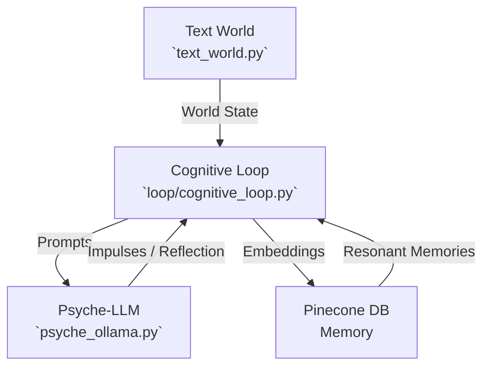
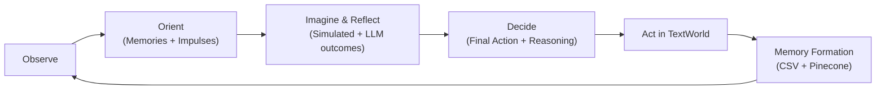

# Project Adam

Project Adam is a simulation designed to explore the principles of **emergent AI behavior**.
This README provides everything you need to **understand, install, run, and analyze** the project.

---

## 🚀 Quick Start

1. **Start the Psyche Service** (subconscious + imagination + reflection):

   ```bash
   python psyche_ollama.py
   ```

2. **Start Adam’s Mind**:

   ```bash
   python main.py
   ```

   Headless mode (no GUI, loop + API only):

   ```bash
   python main.py --headless
   # optional: choose API port
   python main.py --headless --api-port 9090
   # optional: run a fixed number of cycles then exit
   python main.py --headless --cycles 10
   ```

3. **Watch the GUI**:

   * See impulses → imagination → reflection → decision → action.
   * Observe hunger/stress change over time.
   * Track storyline threads and insights.

---

## 1. Introduction

Project Adam is a Python-based simulation of an **Emergent Behavior Agent (EBA)** named Adam.
Unlike traditional scripted NPCs, Adam’s actions are **not hard-coded**. Instead, his behavior emerges from:

* **Psychological drives** (hunger, mood, curiosity, etc.)
* **Subconscious impulses** generated by an LLM (Ollama)
* **Conscious reasoning** that balances impulses, emotions, and goals
* **Persistent memory** stored in a vector database (Pinecone)
* **Environmental events** from a text-based world (TextWorld)

The goal is to model **free-will-like behavior**, where Adam develops habits and personality traits organically over time.

This project was born as an effort to represent the episode Hotel Reverie from Black Mirror series. In this episode, Brandy Friday, a top actor, agrees to star in a high-tech remake of the 1940s romance Hotel Reverie on the condition she plays a gender-swapped version of the male lead. Instead of a traditional shoot, her mind is placed into an AI-driven simulation of the film, where she interacts with digital replicas of the original characters in real time. When Brandy fails at a key piano scene, the story diverges from the original plot, and her attempts to repair it accidentally trigger Clara’s AI character to develop autonomy and consciousness.


---

## 2. Core Components

| Component                | File                    | Role                                                                             |
| ------------------------ | ----------------------- | -------------------------------------------------------------------------------- |
| **Text World**           | `text_world.py`         | Adam’s environment: a text-based apartment with rooms, objects, and events.      |
| **Psyche-LLM**           | `psyche_ollama.py`      | Adam’s subconscious: generates impulses, imagination, and reflection via Ollama. |
| **Memory**               | Pinecone DB             | Stores Adam’s memories as embeddings for long-term recall.                       |
| **Cognitive Loop**       | `loop/cognitive_loop.py` | Adam’s conscious mind: runs the OODA cycle, integrates memory, manages the GUI via `main.py`. |

---

## 3. System Architecture

Adam’s cognition flows between world, psyche, memory, and actions:



---

## 4. Cognitive Loop (OODA Cycle)

Adam’s mind follows the **Observe → Orient → Decide → Act** cycle:



---

## 5. Setup and Installation

### Prerequisites

* Python **3.10+**
* [Ollama](https://ollama.ai/) installed locally
* Pinecone account (optional but recommended)

### Install dependencies

```bash
pip install -r requirements.txt
```

Dependencies:

* `flask`, `requests`, `python-dotenv`
* `sentence-transformers`
* `pinecone-client`
* `tkinter` (bundled with Python on most platforms)

### Configure Environment

Copy the example env file and tweak values:

```bash
cp .env.example .env
```

Then edit `.env` to set pacing, logging, agent initialization, and optional vector memory.

The Flask state API exposes:

- `GET /get_state`: location + mood snapshot
- `GET /metrics`: cycle, mood, hunger, and current KPIs

### Configure Pinecone

1. Sign up at [pinecone.io](https://www.pinecone.io).

2. Create an index:

   | Setting        | Value                      |
   | -------------- | -------------------------- |
   | **Index Name** | `project-adam-memory-text` |
   | **Dimensions** | `384`                      |
   | **Metric**     | `cosine`                   |

3. Add credentials to `.env`:

   ```env
   PINECONE=<your_api_key>
   PINECONE_ENVIRONMENT=us-east-1
   ```

### Pull an Ollama model

```bash
ollama pull qwen3:1.7b
```

(You can also use `llama3`, `mistral`, etc.)

---

## 6. Running the Simulation

```bash
# Terminal 1: Start Psyche (LLM backend)
python psyche_ollama.py

# Terminal 2: Start Adam’s Mind + GUI (preferred)
python main.py

# Or headless
python main.py --headless
```

---

## 6.1 Module Layout (refactor)

Recent refactor split major responsibilities into modules for clarity/testability:

- main.py: entrypoint wiring UI, loop, memory, psyche client, and API
- loop/cognitive_loop.py: OODA cognitive loop
- loop/insight_engine.py: KPI and insights
- services/memory_store.py: embeddings + Pinecone wrapper
- services/psyche_client.py: HTTP client to psyche service
- ui/psyche_monitor.py, ui/ui_bus.py, ui/text_redirector.py: Tkinter UI and helpers
- api.py: Flask state API factory
- config.py: env-backed configuration
- constants.py: shared constants (e.g., CSV LOG_HEADERS)

---

## 6.2 Configuration (env)

You can customize the loop and the agent via environment variables (in your shell or a `.env` file):

- Loop and logging
  - `CYCLE_SLEEP`: seconds between cycles (default: `5`)
  - `IMAGINE_TOP_K`: number of impulses to imagine per cycle (default: `3`)
  - `LOG_FILE`: path to CSV log (default: `adam_loop.log`)
  - `PSYCHE_LLM_API_URL`: psyche HTTP base URL (default: `http://127.0.0.1:5000/`)
  - `LOG_LEVEL`: Python logging level (default: `INFO`)
  - `PSYCHE_TIMEOUT`, `PSYCHE_RETRIES`, `PSYCHE_BACKOFF`: control HTTP client behavior to the psyche service
  - `MEMORY_UPSERT_BATCH`: buffer size for vector upserts to Pinecone (default: `5`)

- Agent initialization
  - Simple keys:
    - `AGENT_MOOD` (default: `neutral`)
    - `AGENT_LEVEL` (default: `0.1`)
    - `AGENT_CURIOSITY` (default: `0.8`)
    - `AGENT_BRAVERY` (default: `0.6`)
    - `AGENT_CAUTION` (default: `0.7`)
    - `AGENT_HUNGER` (default: `0.1`)
    - `AGENT_GOAL` (default: `Find the source of the strange noises in the house.`)
  - Full JSON override (replaces all above):

```bash
export AGENT_STATUS_JSON='{
  "emotional_state": {"mood": "anxious", "level": 0.4},
  "personality": {"curiosity": 0.7, "bravery": 0.4, "caution": 0.8},
  "needs": {"hunger": 0.15},
  "goal": "Calm the environment and rest."
}'
```

- Vector memory (optional; degrades gracefully if unset):
  - `SENTENCE_MODEL` (e.g., `all-MiniLM-L6-v2`)
  - `PINECONE` (API key)
  - `PINECONE_ENVIRONMENT`
  - `PINECONE_INDEX_NAME`

---

## 6.3 Psyche Service (LLM)

The Flask service in `psyche_ollama.py` powers impulses, imagination, and reflection.

- Contracts (Pydantic)
  - Validates all requests and responses:
    - `POST /generate_impulse` → `{ emotional_shift, impulses[] }`
    - `POST /imagine` → `{ outcome }`
    - `POST /reflect` → `{ final_action, reasoning }`
  - Returns `400` with details on invalid payloads.

- Observability
  - Prometheus metrics on `GET /metrics` (text):
    - `psyche_requests_total{endpoint,status}`
    - `psyche_request_seconds{endpoint}` (histogram)
    - `psyche_ollama_calls_total{endpoint,status}`
  - Structured logs via Python `logging` (logger name `psyche`).

- Robustness
  - Retries with exponential backoff for Ollama calls:
    - `OLLAMA_RETRIES` (default `2`)
    - `OLLAMA_BACKOFF` seconds (default `0.5`)

- Run
  - `python psyche_ollama.py` (serves on `http://127.0.0.1:5000/`)
  - Metrics: `http://127.0.0.1:5000/metrics`

- Test
  - `pytest -q` (uses Flask test client and a mocked Ollama backend)

- Curl examples
  - Generate impulses
    ```bash
    curl -s http://127.0.0.1:5000/generate_impulse \
      -H 'Content-Type: application/json' \
      -d '{
            "current_state": {"needs": {"hunger": 0.2}, "goal": "Find the source"},
            "world_state": {"agent_location": "living_room", "sensory_events": []},
            "resonant_memories": []
          }' | jq .
    ```
  - Imagine an action
    ```bash
    curl -s http://127.0.0.1:5000/imagine \
      -H 'Content-Type: application/json' \
      -d '{"action": {"verb": "examine", "target": "door"}}' | jq .
    ```
  - Reflect and choose final action
    ```bash
    curl -s http://127.0.0.1:5000/reflect \
      -H 'Content-Type: application/json' \
      -d '{
            "current_state": {"emotional_state": {"mood": "neutral"}},
            "hypothetical_outcomes": [
              {"action": {"verb": "examine", "target": "door"},
               "imagined": "I see if it is locked.",
               "simulated": "I looked at the door. State: closed"}
            ],
            "recent_memories": []
          }' | jq .
    ```
  - Metrics
    ```bash
    curl -s http://127.0.0.1:5000/metrics | head
    ```

---

## 7. World Simulation

Adam lives in a **virtual apartment** simulated by `TextWorld`:

* **Rooms**: living room, kitchen, bedroom, office
* **Objects**: phone, door, window, TV, radio, fridge, bed, book, computer, plant
* **Actions**: `wait`, `go`, `examine`, `open`, `close`, `read`, `eat`, `answer`, `toggle`, `sleep`, `water`
* **Events**:

  * Random: phone ringing, door knocking, TV static, radio music, computer error
  * Time: day/night cycle every 10 ticks
* **Needs**:

  * `hunger` rises over time → lowered by eating
  * `mood_intensity` rises with stress → lowered by calming actions (sleep, read, answer phone)
  * Relationships (neighbor trust) drift based on your responses; ignoring requests raises stress

* **Goals & Reflection**:
  * Multi-step household goals: brew tea, tend plant, journal, assist the neighbor
  * Adam keeps a rolling diary every few cycles; entries land in long-term memory and nudge his mood

---

## 8. GUI Overview

Running `python main.py` (without `--headless`) opens the **Psyche Monitor**:

* **Vitals Panel**

  * Mood label + progress bar
  * Hunger progress bar (color-coded)
* **Mind Tabs**

  * *Insights*: causal chain, badges (frustration, loops, avoidance), story cards, storyline threads
  * *Subconscious*: impulses + emotional shift JSON
  * *Imagination*: predicted vs simulated outcomes
  * *Decision*: final action + reasoning
* **Live Log**

  * Adam’s narration + world events
* **Storyline Threads**

  * Tracks progress per object (e.g. door storyline, phone storyline)

### GUI Controls

- Pause: stops the loop after the current cycle; UI remains interactive.
- Resume: restarts continuous cycling at the current “Cycle sec” pacing.
- Step: runs exactly one full cycle (Observe → Orient → Imagine/Reflect → Decide → Act). If running, it marks “pause after this cycle”.
- Clear Filter: clears the active storyline filter and restores full context in the panes.
- Save Snapshot: writes a JSON snapshot of the current cycle (agent status, KPIs, last hypothetical outcomes) to `snapshot_<timestamp>.json` in the CWD.
- Copy Metrics: copies the current KPIs JSON to the clipboard.
- Cycle sec: adjusts the delay between cycles (also affects stepping); lower is faster.
- Log: runtime logging level for the live console (DEBUG/INFO/WARNING/ERROR/CRITICAL).
- Font: scales the font size used in the JSON/log panes.
- Dark: toggles a dark color scheme for the text panes.
- Autoscroll: keeps the console pinned to the latest log entries when enabled.
- Simple mode: hides the raw JSON tabs to keep Insights front‑and‑center.

Tips
- Selecting a thread applies a target filter across Subconscious, Imagination, Decision, and the Insights cards. Use “Clear Filter” to reset.
- In Insights, hover the timeline boxes for a quick tooltip; click to set the causal label. When filtered, a small “Target trend” sparkline appears under the badges.

---

## 9. Logs and Memory

* **CSV log** (`adam_behavior_log.csv`):
  Records each cycle with fields:

  ```
  timestamp, cycle_num, agent_id, world_time, location, mood, mood_intensity,
  sensory_events, resonant_memories, impulses, chosen_action, action_result,
  imagined_outcomes, simulated_outcomes, emotional_delta, kpis, snapshot
  ```

* **Pinecone memory**:
  Stores vector embeddings of memories, enabling recall of “resonant” past experiences.

---

# 10. Metrics and KPIs

Project Adam tracks several metrics to quantify Adam’s behavior:

| **Metric**        | **Formula / Source**                                                     | **Meaning**                                                                 |
|--------------------|--------------------------------------------------------------------------|-------------------------------------------------------------------------------|
| Frustration        | Failed actions ÷ total actions (last 10 cycles)                         | High = Adam is failing repeatedly, building stress                           |
| Conflict           | Suppressed strong impulses ÷ total high-urgency impulses                 | High = Adam ignores his strongest urges (internal conflict)                  |
| Novelty            | Unique triggers ÷ total triggers (last 10 cycles)                       | High = Adam experiences diverse stimuli, Low = repetition                     |
| Loop Score         | Longest streak of repeated failed (verb, target) actions, normalized     | High = Adam is stuck in a failure loop                                       |
| Goal Progress      | Heuristic: helpful verbs ~0.5–0.7, detours ~0.2, default ~0.3            | Higher = action aligns with long-term goal                                   |
| Emotional Delta    | JSON: {mood, level_delta, reason} from subconscious                      | Captures how impulses shift mood/stress each cycle                           |
| Snapshot           | JSON summary: triggers, impulses, chosen action, outcome, deltas, KPIs   | Provides structured per-cycle context                                        |
| Badges             | Derived flags (loop, frustration, avoidance)                            | Highlights key patterns: repeating loops, high stress, suppressed impulses    |


## 11. Typical Workflow

1. Start **Psyche** service.
2. Start **GUI + Loop**.
3. Observe Adam:

   * Impulses → Imagination → Reflection → Decision → Action
   * Hunger/stress bars change in real time
   * Insights show loops, frustration, or conflicts
   * CSV + Pinecone record memories for later analysis

---

## 12. Emergent Behaviors

* **Cognitive overload**
  Multiple impulses may overwhelm Adam, leading him to `wait`.

* **Wishful thinking loops**
  Adam may repeatedly attempt failed actions (e.g. opening a locked door).
  The reflection engine + loop-breaking hints reduce this.

* **Stress dynamics**
  Stress rises from repeated failures or unresolved stimuli (ringing phone, knocking door).
  Calming actions visibly reduce stress in the GUI.

* **Storyline progression**
  Threads track per-object attempts and outcomes → e.g. “door storyline: 2 fails, 1 success.”

---

## 13. Analyzing Behavior

Analyze CSV logs in Jupyter/Colab:

* **KPIs**: frustration, conflict, novelty, loop score, goal progress
* **Event chains**: visualize causal lines (trigger → impulse → action → result)
* **Memory recall**: inspect which past events influenced current choices
* **Behavior metrics**: rolling success rate, wait ratio, average impulse urgency, mood deltas

### Notebook Workflow (adam_log_analysis.ipynb)

- Open `adam_log_analysis.ipynb` and run the first cells. It uses `analysis_utils.py` for parsing and plots.
- Default CSV path resolves from `LOG_FILE` in `.env` (written by the GUI) or falls back to `adam_behavior_log.csv`.

Minimal usage inside the notebook:

```python
from analysis_utils import prepare_dataframe, experiment_dashboard, plot_kpi_overlay, kpi_correlation_heatmap

df = prepare_dataframe()  # uses LOG_FILE or default
experiment_dashboard(df, save=True)  # saves figures/ and shows rolling trends

# Overlays by experiment/agent
plot_kpi_overlay(df, metric="frustration", by="experiment_tag", rolling=5)
plot_kpi_overlay(df, metric="mismatch_rate", by="agent_id", rolling=5)

# KPI correlations
kpi_correlation_heatmap(df)
```

If you edit `analysis_utils.py`, reload it in-place:

```python
import importlib, analysis_utils as au
au = importlib.reload(au)
```

---

## 14. Extending the Project

Ideas for expansion:

* Add new **rooms/objects** (balcony, bathroom, etc.)
* Extend **actions** (cook, write, repair, play music)
* Add **personality sliders** (curiosity, bravery, caution) → bias impulses
* Simulate **multi-agent interactions** (Adam + another character)
* Experiment with different Ollama models for subconscious & reflection

---

## 15. Configuration Deep-Dive

Project Adam reads its configuration from environment variables (via `.env`). The table below lists the most relevant values.

| Category | Key | Description |
| --- | --- | --- |
| **Logging & Metrics** | `LOG_FILE` | CSV written by the loop (`adam_behavior_log.csv` by default). |
| | `LOG_LEVEL` | Runtime log verbosity (DEBUG/INFO/…). |
| **Psyche / LLM** | `PSYCHE_LLM_API_URL` | Where the subconscious Flask service is listening. |
| | `OLLAMA_MODEL` | Model alias loaded by `psyche_ollama.py`. |
| | `PSYCHE_TIMEOUT`, `PSYCHE_RETRIES`, `PSYCHE_BACKOFF` | Retry/backoff policy for psyche calls. |
| **Memory Backend** | `MEMORY_BACKEND` | Choose `chroma` (default, local persistent store) or `pinecone` (managed service). |
| | `CHROMA_PATH` | Filesystem path for Chroma’s persistent data (default `./chroma`). |
| | `CHROMA_COLLECTION` | Collection name used by Chroma (defaults to `PINECONE_INDEX_NAME` or `adam-memory`). |
| **Pinecone (optional)** | `PINECONE_API_KEY` | API key when using the Pinecone backend (fallback env: `PINECONE`). |
| | `PINECONE_INDEX_NAME` | Index name for Pinecone memories. |
| | `PINECONE_CLOUD`, `PINECONE_REGION` | Serverless deployment (e.g. `aws`, `us-east-1`). Inferred from `PINECONE_ENVIRONMENT` if unset. |
| **Embeddings** | `SENTENCE_MODEL` | SentenceTransformer model; the memory store auto-detects embedding dimension. |
| **Loop Pacing** | `CYCLE_SLEEP` | Delay between cycles (seconds). |
| | `IMAGINE_TOP_K` | Number of impulses fed into imagination/reflection. |
| **Agent Personality** | `AGENT_STATUS_JSON` | JSON override for the full agent state. |
| | `AGENT_MOOD`, `AGENT_LEVEL`, `AGENT_CURIOSITY`, `AGENT_BRAVERY`, `AGENT_CAUTION`, `AGENT_HUNGER`, `AGENT_GOAL` | Fine-grained overrides when not supplying JSON. |

### Quick Checklist

1. Duplicate `.env.example` (or create `.env`) and fill in `PINECONE_API_KEY`, `PINECONE_INDEX_NAME`, `OLLAMA_MODEL`.
2. By default the loop persists memories locally with Chroma (`MEMORY_BACKEND=chroma`). To switch back to Pinecone, set `MEMORY_BACKEND=pinecone` and supply `PINECONE_*` env vars.
3. Adjust `CYCLE_SLEEP` for long experiments; shorter times increase responsiveness at the cost of CPU.
4. Switch to `LOG_LEVEL=DEBUG` when diagnosing loop issues or new actions.

---

## 16. Memory Pipeline Overview

With the upgraded `MemoryStore`, Project Adam adapts automatically to the embedding model’s dimension and Pinecone’s serverless API.

```mermaid
flowchart LR
    subgraph Cognitive Loop
        A[Observe / Orient]
        A --> B[Imagine & Reflect]
        B --> C[Act]
        C --> D[(Narrative Event)]
    end

    D -->|append| E[CSV Log (`LOG_FILE`)]
    D -->|upsert| F[MemoryStore]
    F -->|encode| G[SentenceTransformer\n(auto dimension)]
    G -->|vectors| H[Pinecone Serverless Index]
    H -->|query| F
    F -->|resonant memories| A

    I[`PINECONE_API_KEY`, `PINECONE_CLOUD`, `PINECONE_REGION`]
    I --> F
```

Highlights:

- Embedding dimension is taken from `SentenceTransformer.get_sentence_embedding_dimension()`, preventing index mismatches.
- Legacy environment strings such as `us-west1-gcp` are parsed to infer cloud/region when you have not set them explicitly.
- Missing credentials degrade gracefully—cycles continue, but vector writes are skipped with warnings.

---

## 17. Tutorials

### 17.1 Swap LLM Backends

1. **Change the Ollama model**:

   ```bash
   # .env
   OLLAMA_MODEL=llama3
   ```

   Restart `psyche_ollama.py` to load the model.

2. **Point to an OpenAI-compatible gateway**:

   ```bash
   export PSYCHE_LLM_API_URL=http://localhost:8000
   export OLLAMA_MODEL=gpt-4o-mini
   ```

   Replace the `ollama.chat` calls with the gateway’s SDK while keeping the same prompts and response contracts.

3. **Mix models per endpoint**: call different providers inside `generate_impulse`, `imagine`, and `reflect` (e.g. cheaper model for imagination, larger model for reflection).

> Increase `PSYCHE_TIMEOUT` if your hosted model takes longer to respond.

### 17.2 Headless Experiment Pipeline

1. Start the psyche service: `python psyche_ollama.py`.
2. Launch the loop headlessly with custom pacing and log location:

   ```bash
   LOG_FILE=experiments/2025-09-14-fridge.csv \
   CYCLE_SLEEP=1.5 \
   python main.py --headless --cycles 200 --api-port 9090
   ```

3. Monitor via Prometheus-style metrics:

   ```bash
   curl http://127.0.0.1:9090/metrics | jq
   ```

4. Plot results quickly:

   ```python
   from analysis_utils import prepare_dataframe, plot_kpis

   df = prepare_dataframe("experiments/2025-09-14-fridge.csv")
   plot_kpis(df, rolling=5)
   ```

### 17.3 Add a New Action

1. **Physics** – extend `text_world.py`:

   ```python
   if verb == "play" and target == "piano":
       return {"success": True, "reason": "A mellow tune fills the room."}
   ```

   Add the `piano` object with relevant properties to a room.

2. **Subconscious toolbox** – include the new verb in the prompt hint inside `psyche_ollama.py`.

3. **Reflection hints** – optionally describe new consequences in `generate_reflection_prompt`.

Restart the loop—Adam will begin exploring the new behavior once impulses surface.

---

## 18. Troubleshooting Cheatsheet

| Symptom | Likely cause | Suggested fix |
| --- | --- | --- |
| GUI status shows “Subconscious offline” | LLM service unreachable. | Confirm `psyche_ollama.py` is running, API URL is correct, and no firewall blocks `PSYCHE_LLM_API_URL`. |
| Memory queries always empty | Pinecone credentials missing or index dimension mismatch. | Verify `PINECONE_API_KEY`, `PINECONE_INDEX_NAME`, and ensure the index dimension matches `SentenceTransformer`. |
| Loop hangs during Orient | LLM responses timing out. | Raise `PSYCHE_TIMEOUT`, reduce `IMAGINE_TOP_K`, or choose a lighter model. |
| No CSV generated | `LOG_FILE` unwritable or process lacks permission. | Point `LOG_FILE` to a writable path and re-run. |
| `/metrics` returns 500 | Flask API thread isn’t running in headless mode. | Start `main.py --headless` or restart the process. |

Capture verbose logs with `LOG_LEVEL=DEBUG` and share them when filing issues.

---

For details on the optional security simulation harness (**AdamSec**), see `adamsec/README.md`.

---

## ✅ Summary

Project Adam is a sandbox for experimenting with **emergent AI behavior**:

* A **world** that generates stimuli
* A **psyche** that produces impulses and imagination
* A **cognitive loop** that reasons, decides, and acts
* A **memory system** that grows with experience

Together, these simulate an agent who doesn’t just follow a script — but **develops patterns, frustrations, and habits** in a believable way.

---
