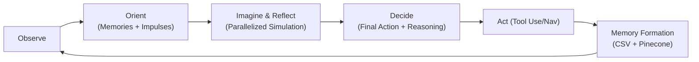

# Project Adam

Project Adam is a simulation designed to explore the principles of **emergent AI behavior**.
This README provides everything you need to **understand, install, run, and analyze** the project.

---

## 🚀 Quick Start

1. **Start the Psyche Service** (structured output + template rendering + parallel cognition):

   ```bash
   python psyche_ollama.py
   ```

2. **Start Adam’s Mind**:

   ```bash
   python main.py
   ```

   Headless mode (no GUI, loop + API only):

   ```bash
   python main.py --headless
   # optional: choose API port
   python main.py --headless --api-port 9090
   # optional: run a fixed number of cycles then exit
   python main.py --headless --cycles 10
   ```

3. **Watch the GUI**:

   * See impulses → imagination → reflection → decision → action.
   * Observe hunger/stress change over time.
   * Track storyline threads and insights.

---

## 1. Introduction

Project Adam is a Python-based simulation of an **Emergent Behavior Agent (EBA)** named Adam.
Unlike traditional scripted NPCs, Adam’s actions are **not hard-coded**. Instead, his behavior emerges from:

* **Psychological drives** (hunger, mood, curiosity, etc.)
* **Subconscious impulses** generated by an LLM (Ollama) via explicit Prompt Templates.
* **Conscious reasoning** that balances impulses, emotions, and goals using Structured Outputs.
* **Persistent memory** stored in a vector database (Pinecone), with daily **Consolidation** (dreams).
* **Embodied Environment** featuring 2D Grid navigation, multi-modal sensory perception, and tool use.
* **Dynamic Agency**: Adam sets his own goals based on needs when he is idle.

The goal is to model **free-will-like behavior**, where Adam develops habits and personality traits organically over time.

This project was born as an effort to represent the episode Hotel Reverie from Black Mirror series. In this episode, Brandy Friday, a top actor, agrees to star in a high-tech remake of the 1940s romance Hotel Reverie on the condition she plays a gender-swapped version of the male lead. Instead of a traditional shoot, her mind is placed into an AI-driven simulation of the film, where she interacts with digital replicas of the original characters in real time. When Brandy fails at a key piano scene, the story diverges from the original plot, and her attempts to repair it accidentally trigger Clara’s AI character to develop autonomy and consciousness.


---

## 2. Core Components

| Component                | File                    | Role                                                                             |
| ------------------------ | ----------------------- | -------------------------------------------------------------------------------- |
| **Text World**           | `text_world.py`         | Adam’s environment: 2D Grid Map, objects, and Tool Use physics.                  |
| **Sensory Cortex**       | `sensory.py`            | Translates raw data (temp, noise) into qualitative "qualia" strings ("It feels bone-chilling"). |
| **Psyche-LLM**           | `psyche_ollama.py`      | Adam’s subconscious: `instructor`-powered structured outputs using Jinja2 templates. |
| **Memory**               | Pinecone DB             | Stores Adam’s memories as embeddings for long-term recall.                       |
| **Cognitive Loop**       | `loop/cognitive_loop.py` | Adam’s conscious mind: runs the OODA cycle, integrates memory, manages the GUI via `main.py`. |

---

## 3. System Architecture

Adam’s cognition flows between world, psyche, memory, and actions:

```mermaid
flowchart TD
    A[Text World + Sensory Cortex] -->|Qualia & Metrics| B[Cognitive Loop]
    B -->|Structured Prompts| C[Psyche-LLM (Ollama+Instructor)]
    C -->|Impulses / Reflection| B
    B -->|Embeddings| D[Pinecone DB]
    D -->|Resonant Memories| B
```

---

## 4. Cognitive Loop (OODA Cycle)

Adam’s mind follows the **Observe → Orient → Decide → Act** cycle:



---

## 5. Setup and Installation

### Prerequisites

* Python **3.10+**
* [Ollama](https://ollama.ai/) installed locally
* Pinecone account (optional but recommended)

### Install dependencies

```bash
pip install -r requirements.txt
```

Dependencies:

* `flask`, `requests`, `python-dotenv`
* `instructor`, `openai` (for structured output enforcement)
* `jinja2` (for prompt templating)
* `sentence-transformers`
* `pinecone-client`
* `tkinter` (bundled with Python on most platforms)

### Configure Environment

Copy the example env file and tweak values:

```bash
cp .env.example .env
```

Then edit `.env` to set pacing, logging, agent initialization, and optional vector memory.

### Configure Pinecone

1. Sign up at [pinecone.io](https://www.pinecone.io).

2. Create an index:

   | Setting        | Value                      |
   | -------------- | -------------------------- |
   | **Index Name** | `project-adam-memory-text` |
   | **Dimensions** | `384`                      |
   | **Metric**     | `cosine`                   |

3. Add credentials to `.env`:

   ```env
   PINECONE=<your_api_key>
   PINECONE_ENVIRONMENT=us-east-1
   ```

### Pull an Ollama model

```bash
ollama pull qwen2.5:14b
```

(You can also use `llama3`, `mistral`, etc., but we recommend models with strong structured output capabilities)

---

## 6. Running the Simulation

```bash
# Terminal 1: Start Psyche (LLM backend)
python psyche_ollama.py

# Terminal 2: Start Adam’s Mind + GUI (preferred)
python main.py

# Or headless
python main.py --headless
```

---

## 7. World Simulation (Embodiment)

Adam lives in a **virtual apartment** simulated by `TextWorld` and `GridMap`:

* **Navigation**: Adam moves via cardinal directions (North, South, East, West) on a 2D Grid. He has physical coordinates `(x, y)`.
* **Senses**: `SensoryCortex` translates raw inputs (temperature, lighting, noise, cleanliness) into narrative qualia.
* **Tool Use**: Adam can combine objects contextually (e.gl, `use toolkit on computer` to repair it).
* **Rooms**: Living Room `(0,0)`, Kitchen `(0,1)`, Bedroom `(1,0)`, Office `(-1,0)`, and randomly grafted optional rooms (Balcony, Basement).
* **Objects**: Interactive properties (`openable`, `toggleable`, `readable`, `repairable`).
* **Events**: Random environmental triggers (power flicker, drafts, appliance failures).
* **Needs**: Hunger, Mood Intensity, Social Trust (Neighbor).

---

## 8. Psyche Service (LLM)

The Flask service in `psyche_ollama.py` has been upgraded to **Phase 1 Robustness standards**:

- **Strict Schema Enforcement**: Uses `instructor` to guarantee valid JSON outputs for every request. No more parsing errors.
- **Templated Prompts**: All prompts are logically separated in `templates/*.j2`, making personality tweaks easy.
- **Parallel Cognition**: `imagine_batch` endpoint allows imagining multiple scenarios simultaneously.

- Contracts (Pydantic):
  - `POST /generate_impulse` → `{ emotional_shift, impulses[] }`
  - `POST /imagine` → `{ outcome }`
  - `POST /imagine_batch` → `{ outcomes[] }`
  - `POST /reflect` → `{ final_action, reasoning, new_goal }`
  - `POST /consolidate` → `{ insight }` (NEW in Phase 3)
  - `POST /reflect` (Phase 4 Update) → `{ ..., new_goal, new_goal_plan }`

---

## 9. Agency & Autonomy (Phase 4)

Adam is no longer just reactive. He exhibits **Long-Term Autonomy**:

*   **Dynamic Goals**: If Adam has no goal, he asks Psyche to propose one based on his needs (e.g., "I am hungry" → "Find Food").
*   **Hierarchical Planning**: Psyche breaks down goals into steps (e.g., `["Find Key", "Unlock Door"]`), and `TextWorld` tracks progress.
*   **Skill Acquisition**: The `InsightEngine` tracks successful actions. "Mastered Skills" (high success rate) are fed back into the subconscious to encourage using known-good tools.

---

## 10. Evaluation Harness (Phase 5)

We ensure Adam's intelligence doesn't regress using a **Continuous Evaluation** suite:

*   **Scenarios**: `scenarios/` contains Python definitions for standardized tests (e.g., `hunger_test.py`).
*   **Benchmark Tool**:
    ```bash
    python benchmark.py --scenario hunger_test --runs 10
    ```
    Runs the agent in headless mode and reports Win/Loss % and Avg Cycles.


---

---

## 11. GUI Overview

Running `python main.py` (without `--headless`) opens the **Psyche Monitor**:

* **Vitals Panel**: Mood, Hunger, Current Goal.
* **Mind Tabs**:
  * *Insights*: causal chain, badges (frustration, loops, avoidance).
  * *Subconscious*: impulses + emotional shift JSON.
  * *Imagination*: predicted vs simulated outcomes.
  * *Decision*: final action + reasoning.
* **Live Log**: Adam’s narration + world events.
* **Storyline Threads**: Tracks progress per object.

### GUI Controls

- **Pause/Resume/Step**: Control the loop pacing.
- **Save Snapshot**: Dump current state to JSON.
- **Simple Mode**: Hide raw JSON tabs.

---

---

## 12. Metrics and KPIs

Project Adam tracks several metrics to quantify Adam’s behavior:

| **Metric**        | **Formula / Source**                                                     | **Meaning**                                                                 |
|--------------------|--------------------------------------------------------------------------|-------------------------------------------------------------------------------|
| Frustration        | Failed actions ÷ total actions (last 10 cycles)                         | High = Adam is failing repeatedly, building stress                           |
| Conflict           | Suppressed strong impulses ÷ total high-urgency impulses                 | High = Adam ignores his strongest urges (internal conflict)                  |
| Novelty            | Unique triggers ÷ total triggers (last 10 cycles)                       | High = Adam experiences diverse stimuli, Low = repetition                     |
| Loop Score         | Longest streak of repeated failed actions                                | High = Adam is stuck in a failure loop                                       |
| Goal Progress      | Alignment with active high-level goal tasks                              | Higher = action aligns with long-term goal                                   |
| Emotional Delta    | JSON: {mood, level_delta, reason} from subconscious                      | Captures how impulses shift mood/stress each cycle                           |

---

---

## 13. Customization

### Personality Packs (Templates)
Modify `templates/subconscious.j2` to change Adam's inner voice. You can make him anxious, stoic, poetic, or aggressive by changing the system prompt text.

### World Generation
Modify `text_world.py` to add new Room Templates or change the procedural generation logic in `_generate_layout`.

### New Actions
1. **Physics**: Add handler to `TextWorld` (e.g., `_act_paint`).
2. **Prompts**: Add verb to `templates/subconscious.j2` toolbox.

---
