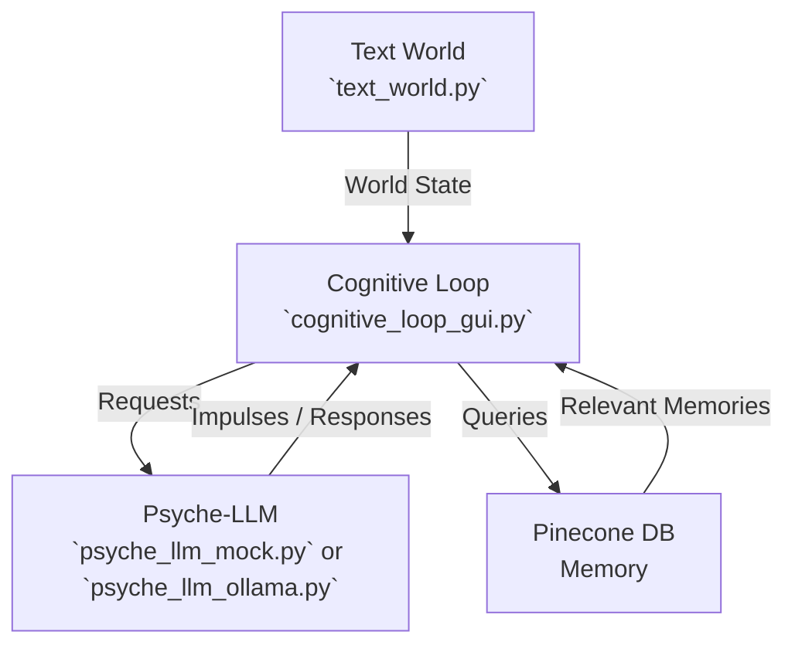

# Project Adam: Documentation

Welcome to Project Adam, a simulation designed to explore the principles of emergent AI behavior. This document provides a comprehensive guide to understanding, running, and analyzing the project.

---

## 1. Introduction

Project Adam is a Python-based simulation of an **Emergent Behavior Agent (EBA)** named Adam. Unlike traditional, scripted AI characters, Adam's actions are not predetermined. Instead, his behavior emerges from a set of core psychological drives, a persistent memory, and his real-time perception of a simulated world.

The goal of this project is to create a believable, non-player character (NPC) whose personality and habits develop organically over time based on his unique experiences.

---

## 2. Core Concepts

The architecture of Project Adam is built on four key components that work together to simulate a mind.

| Component | File | Description |
|-----------|------|-------------|
| **Text World** | `text_world.py` | Adam’s reality: a text-based simulation of an apartment with objects and events. |
| **Psyche-LLM** | `psyche_llm_mock.py` or `psyche_llm_ollama.py` | Adam’s subconscious: generates impulses using memory + drives. |
| **Memory** | Pinecone DB | Stores long-term experiences as text embeddings. |
| **Cognitive Loop** | `cognitive_loop_gui.py` | Adam’s conscious mind: observe → orient → decide → act → remember. |

---

## 3. System Architecture

The system consists of three main scripts that communicate over local HTTP.



- **Psyche-LLM** → Flask API serving subconscious responses.  
- **Cognitive Loop** → Runs GUI, logic, and connects all parts.  
- **Text World** → Provides environment events and reacts to actions.  

---

## 4. Cognitive Loop (OODA Cycle)

```mermaid
flowchart LR
    O[Observe] --> R[Retrieve Memories<br/>+ Psyche Impulses]
    R --> D[Decide Action<br/>(Personality Weighing)]
    D --> A[Act in Text World]
    A --> M[Form New Memory]
    M --> O
```

---

## 5. Setup and Installation

### Step 1: Install Dependencies

Requires Python 3. Install libraries:

```bash
pip install requests flask sentence-transformers pinecone-client pandas matplotlib seaborn ollama
```

### Step 2: Set Up Pinecone

| Setting | Value |
|---------|-------|
| **Index Name** | `project-adam-memory-text` |
| **Dimensions** | `384` |
| **Metric** | `cosine` |

1. Sign up at [Pinecone.io](https://www.pinecone.io).  
2. Create an index with the above values.  
3. Copy your **API Key** and **Environment name**.  

### Step 3: Configure the Script

Edit `cognitive_loop_gui.py` and insert your Pinecone credentials.

---

## 6. Running the Simulation

### Option A: Basic Simulation (Mock LLM)

```bash
# Start the Subconscious
python psyche_llm_mock.py

# Start Adam's Mind
python cognitive_loop_gui.py
```

### Option B: Advanced Simulation (Ollama LLM)

```bash
# Install and Run Ollama
ollama pull llama3:8b

# Start the Subconscious
python psyche_llm_ollama.py

# Start Adam's Mind
python cognitive_loop_gui.py
```

---

## 7. Understanding the Output

| Method | Description |
|--------|-------------|
| **Console Output** | Detailed OODA loop step-by-step. |
| **Psyche Monitor GUI** | Real-time view of Adam's internal state. |
| **Behavior Log (`adam_behavior_log.csv`)** | CSV file recording every thought cycle. |

---

## 8. Observing Emergent Behavior

### Cognitive Overload / Analysis Paralysis
- Triggered by multiple simultaneous events.  
- Adam may freeze and wait, simulating **cognitive overload**.  

### Delusional Obsession / Wishful Thinking
- Adam may invent false scenarios to pursue goals.  
- Example: repeatedly checking the fridge for "hidden clues."  
- Demonstrates **AI delusion** and **wishful thinking loops**.  

---

## 9. Analyzing Adam's Behavior

After running the simulation, stop the scripts and run:

```bash
python analyze_behavior.py
```

This generates behavior plots as `.png` files.

---
