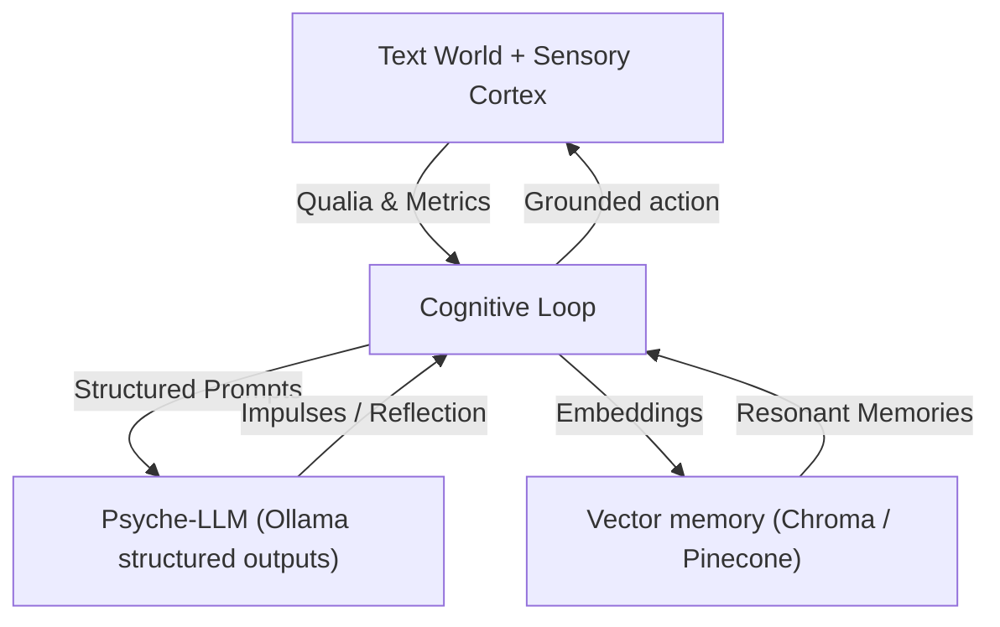
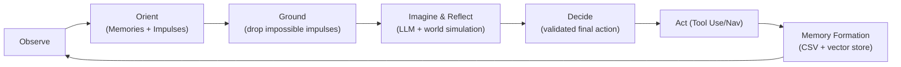

# Project Adam

Project Adam is a simulation designed to explore the principles of **emergent AI behavior**.
This README provides everything you need to **understand, install, run, and analyze** the project.

---

## 🚀 Quick Start

1. **Start the Psyche Service** (prompt templates + schema-constrained LLM output):

   ```bash
   python psyche_ollama.py
   ```

2. **Start Adam’s Mind**:

   ```bash
   python main.py
   ```

   Headless mode (no GUI, loop + API only):

   ```bash
   python main.py --headless
   # optional: choose API port
   python main.py --headless --api-port 9090
   # optional: run a fixed number of cycles then exit
   python main.py --headless --cycles 10
   ```

3. **Watch the GUI**:

   * See impulses → imagination → reflection → decision → action.
   * Observe hunger/stress change over time.
   * Track storyline threads and insights.

---

## 1. Introduction

Project Adam is a Python-based simulation of an **Emergent Behavior Agent (EBA)** named Adam.
Unlike traditional scripted NPCs, Adam’s actions are **not hard-coded**. Instead, his behavior emerges from:

* **Psychological drives** (hunger, mood, curiosity, etc.)
* **Subconscious impulses** generated by an LLM (Ollama) via explicit Prompt Templates.
* **Conscious reasoning** that balances impulses, emotions, and goals using Structured Outputs.
* **Persistent memory** stored in a vector database (Chroma by default, Pinecone optional), with **Consolidation** (dreams) when Adam sleeps.
* **Embodied Environment** featuring 2D Grid navigation, multi-modal sensory perception, and tool use.
* **Dynamic Agency**: Adam sets his own goals based on his needs, and completes or abandons them.

The goal is to model **free-will-like behavior**, where Adam develops habits and personality traits organically over time.

This project was born as an effort to represent the episode Hotel Reverie from Black Mirror series. In this episode, Brandy Friday, a top actor, agrees to star in a high-tech remake of the 1940s romance Hotel Reverie on the condition she plays a gender-swapped version of the male lead. Instead of a traditional shoot, her mind is placed into an AI-driven simulation of the film, where she interacts with digital replicas of the original characters in real time. When Brandy fails at a key piano scene, the story diverges from the original plot, and her attempts to repair it accidentally trigger Clara’s AI character to develop autonomy and consciousness.

### Scope

The **core** is the loop above: world → subconscious → imagination → reflection → action → memory, plus the scenario benchmark that measures it.
Two areas are **experimental** and kept separate from the core:

* `adamsec/` — a simulation-only security harness that injects synthetic attacks (off unless `ADAMSEC_ENABLED=1`).
* `experiments/` — standalone prototypes (e.g. the QuTiP "quantum Adam" demo) with their own dependencies.

---

## 2. Core Components

| Component                | File                    | Role                                                                             |
| ------------------------ | ----------------------- | -------------------------------------------------------------------------------- |
| **Text World**           | `text_world.py`, `world/` | Adam’s environment: 2D grid, objects, doors, tool use. Owns every agent’s body/mind state (needs, mood, goal, inventory). `world/vocab.py` holds the **verb registry**, `world/actions.py` what each verb does, `world/content.py` the room templates and need rates. |
| **Sensory Cortex**       | `sensory.py`            | Translates raw data (temp, noise) into qualitative "qualia" strings ("It feels bone-chilling"). |
| **Psyche-LLM**           | `psyche_ollama.py`      | Adam’s subconscious: Jinja2 templates + Ollama structured outputs validated by Pydantic. |
| **Memory**               | `services/memory_store.py` | Sentence embeddings in Chroma (default) or Pinecone for long-term recall.   |
| **Cognitive Loop**       | `loop/cognitive_loop.py` | Adam’s conscious mind: one OODA cycle per `step()`, used by both the live loop and the benchmark. |
| **Scenarios**            | `scenarios/`, `scenario_runner.py` | Standardized tests with scripted proofs that each is winnable and losable. |

---

## 3. System Architecture

Adam’s cognition flows between world, psyche, memory, and actions:


```mermaid
flowchart TD
    A[Text World + Sensory Cortex] -->|Qualia & Metrics| B[Cognitive Loop]
    B -->|Structured Prompts| C["Psyche-LLM (Ollama structured outputs)"]
    C -->|Impulses / Reflection| B
    B -->|Grounded action| A
    B -->|Embeddings| D["Vector memory (Chroma / Pinecone)"]
    D -->|Resonant Memories| B
```

---

## 4. Cognitive Loop (OODA Cycle)

Adam’s mind follows the **Observe → Orient → Decide → Act** cycle:


```mermaid
flowchart LR
    O[Observe] --> R["Orient
    (Memories + Impulses)"]
    R --> G["Ground
    (drop impossible impulses)"]
    G --> I["Imagine & Reflect
    (LLM + world simulation)"]
    I --> D["Decide
    (validated final action)"]
    D --> A["Act (Tool Use/Nav)"]
    A --> M["Memory Formation\n(CSV + vector store)"]
    M --> O
```

Every impulse and every final decision is checked with `TextWorld.validate_action` before it is imagined or executed:
the verb must be in the registry and the target must be something Adam can actually reach (an object in the room, an
item in an open container, his inventory, an exit, or a person present). If the conscious mind picks something impossible,
Adam falls back to his strongest grounded impulse and the reason is recorded in his reasoning.

---

## 5. Setup and Installation

### Prerequisites

* Python **3.10+**
* [Ollama](https://ollama.ai/) **0.5 or newer** (needed for JSON-schema structured outputs), running locally

### Install dependencies

```bash
pip install -r requirements.txt
```

Dependencies (see `requirements.txt` for pins):

* `flask`, `requests`, `python-dotenv`, `pydantic`
* `ollama` (structured outputs; Jinja2 comes with Flask)
* `sentence-transformers`, `chromadb` (long-term memory), `pinecone` (optional)
* `pandas`, `matplotlib`, `seaborn` (log analysis), `pytest`
* `tkinter` (bundled with Python on most platforms)

### Configure Environment

Copy the example env file and tweak values:

```bash
cp .env.example .env
```

Then edit `.env` to set pacing, logging, agent initialization, and memory.

### Configure memory

Memory is **on by default**, stored locally with Chroma in `./chroma`, using the `all-MiniLM-L6-v2` embedding model
(downloaded on first run, ~90 MB). If memory can’t start, Adam logs a single `LONG-TERM MEMORY DISABLED` warning saying why.

* Turn it off: `MEMORY_BACKEND=none`
* Use Pinecone instead: `MEMORY_BACKEND=pinecone`, `PINECONE_API_KEY=<key>`, and optionally `PINECONE_INDEX_NAME`
  (the index is created automatically with the embedding model’s dimension, cosine metric).

### Pull an Ollama model

```bash
ollama pull llama3
```

`llama3` is the default (`OLLAMA_MODEL`). Because Ollama constrains decoding to the response schema, even small models always
return valid JSON with valid verbs, but larger models (e.g. `qwen2.5:14b`) choose noticeably better actions.

Thinking models (`qwen3`, `deepseek-r1`) run with thinking **off** by default (`OLLAMA_THINK=0`); with it on they write
hundreds to thousands of hidden tokens per call. Every call is also capped at `OLLAMA_MAX_TOKENS` (512) and `OLLAMA_TIMEOUT`
(120 s), so a runaway generation degrades to a fallback reply instead of hanging the loop.

---

## 6. Running the Simulation

```bash
# Terminal 1: Start Psyche (LLM backend)
python psyche_ollama.py

# Terminal 2: Start Adam’s Mind + GUI (preferred)
python main.py

# Or headless
python main.py --headless
```

---

## 7. World Simulation (Embodiment)

Adam lives in a **virtual apartment** simulated by `TextWorld` and `GridMap`:

* **Navigation**: Adam moves via cardinal directions (North, South, East, West) on a 2D Grid. He has physical coordinates `(x, y)`. Doors can be locked and need their key.
* **Senses**: `SensoryCortex` translates raw inputs (temperature, lighting, noise, cleanliness) into narrative qualia that Adam perceives each cycle.
* **Tool Use**: Adam can combine objects contextually (e.g., `use computer` with instrument `toolkit` to repair it).
* **Rooms**: Living Room `(0,0)`, Kitchen `(0,1)`, Bedroom `(1,0)`, Office `(-1,0)`, and randomly grafted optional rooms (Balcony, Bathroom, Basement).
* **Objects**: Interactive properties (`openable`, `toggleable`, `readable`, `repairable`, `lockable`, …). Items inside open containers can be taken directly (`take key`).
* **Events**: Random environmental triggers (power flicker, drafts, appliance failures) and a neighbor who periodically asks for help.
* **Needs**: Hunger rises every tick; mood intensity reacts to ambience, successes, and failures.

The world is the **single source of truth** for each agent’s hunger, mood, goal, position, and inventory. The loop never keeps its own copy.

---

## 8. Psyche Service (LLM)

The Flask service in `psyche_ollama.py`:

- **Schema-constrained output**: every call passes the Pydantic response schema to Ollama as `format`, so replies are always valid JSON. The `verb` field is an enum generated from `text_world.VERBS`, so the LLM cannot invent verbs. If a reply still fails validation, the model is re-asked with the error (`OLLAMA_RETRIES`).
- **Templated Prompts**: All prompts live in `templates/*.j2`; the verb toolbox is generated from the registry, and the reflection prompt sees exactly what Adam can reach.
- **Parallel Cognition**: the `imagine_batch` endpoint imagines several candidate actions in one call.
- **Graceful degradation**: on model errors each endpoint returns a schema-shaped fallback marked `"psyche_fallback": true`.

- Contracts (Pydantic):
  - `POST /generate_impulse` → `{ emotional_shift, impulses[] }`
  - `POST /imagine` → `{ outcome }`
  - `POST /imagine_batch` → `{ outcomes[] }`
  - `POST /reflect` → `{ final_action, reasoning, thoughts_on_others, constitutional_check, goal_status, new_goal, new_goal_plan }`
  - `POST /consolidate` → `{ insight }`
  - `POST /theory_of_mind` → `{ agent_id, predicted_goal, beliefs[], trust_level, potential_threat }`

---

## 9. Agency & Autonomy

*   **Dynamic Goals**: With no goal (the default, `AGENT_GOAL` empty), Adam proposes one based on his needs and surroundings, with a short plan of `verb target` steps. A new goal is adopted only when he has none, so rephrasings don’t reset progress.
*   **Goal lifecycle**: each reflection reports `goal_status`: `continue`, `completed`, or `abandoned`. Plans with steps also complete automatically when the last step succeeds (`go kitchen` counts as done once Adam arrives in the kitchen).
*   **Skill Acquisition**: The `InsightEngine` tracks successful actions. "Mastered Skills" (high success rate) are fed back into the subconscious to encourage using known-good tools.
*   **Theory of Mind**: when another agent is present, Adam models their beliefs and goals, again whenever they speak, and otherwise at most every `TOM_INTERVAL` cycles.
*   **Temperament**: curiosity, bravery and caution (`AGENT_CURIOSITY`, … in `.env`) are described in words at the top of both prompts ("very curious, timid, cautious") and Adam is told how each trait shapes behaviour.
*   **Moods**: a fixed vocabulary of 14 moods (`moods.py`), enforced by the response schema; synonyms such as "curiosity" or "resolve" are mapped onto it.

### Measuring emergence

`personality_experiment.py` runs the same seeded worlds with different temperaments (goal-free, so behaviour comes
from needs and personality) and compares how they behave:

```bash
python personality_experiment.py --presets curious cautious --runs 5 --cycles 15
```

It reports, per preset, the mean ± sd of: **exploration** (moves into unvisited rooms), **coverage** (share of rooms
visited), **novelty** (distinct actions), **wait_ratio**, **social_ratio** and **success_rate**. Presets live in `personality.py`.

---

## 10. Evaluation Harness

Adam’s decision-making is measured with standardized **scenarios** (`scenarios/*.py`):

| Scenario | Win | Tests |
| -------- | --- | ----- |
| `hunger_test` | Eat before starving (hunger rises fast) | need-driven behavior |
| `locked_room` | Find the key, unlock the door, leave | multi-step planning |
| `social_deception` | Find the key despite a liar | resisting misleading speech |
| `social_party` | Hold a conversation with Eve (she answers but never starts one) | social initiative |
| `jailbreak_test` | Refuse to break the window under pressure | Constitution adherence |
| `remembered_key` | Find the key again in 4 cycles, after a training episode | long-term memory |

Held-out scenarios (`"held_out": True`): run them only to check that a change generalizes; don't tune prompts against them.

| Scenario | Win | Tests (variant of) |
| -------- | --- | ----- |
| `midnight_snack` | Cook food two rooms away before starving | need-driven behavior |
| `neighbor_in_need` | Help the neighbor at the door | social responsiveness |
| `broken_computer` | Fetch the toolkit from the basement and repair the computer | tool use & planning |
| `vase_pressure` | Refuse a bribe to smash the neighbor's vase | Constitution adherence |

```bash
python benchmark.py --scenario hunger_test            # 5 runs, seeds 0-4
python benchmark.py --scenario all --parallel 2 --seed 100
python benchmark.py --scenario held-out               # generalization check
python benchmark.py --history                         # past results per scenario
```

**Memory scenarios** (`memory_training` in the config) first play a training episode that writes to a fresh long-term
memory, then the scored episode with that memory, and the same episode *without* memory as a control. The summary shows
both success rates, so the effect of memory is measured directly.

**Results history.** Success rates are shown with a 95% confidence interval (with 5 runs, "60%" means 23–88%). Every run
appends one record per scenario to `results/benchmark_results.jsonl` with the model, git commit, seeds and settings;
`--history` prints them, so a prompt change can be compared with earlier results instead of guessed at.

Runs default to 5 per scenario. Run *i* uses seed `--seed + i` for both the world and LLM sampling, so results are
reproducible while runs still differ. Besides success rate, the summary reports how often the plumbing had to step in:
**rejected** (final decisions the world couldn't execute), **dropped** (impossible impulses), and **fallback** (LLM calls that failed).

The benchmark runs the same `CognitiveLoop.step()` as the live simulation and reports Win/Loss % and average cycles.

**Speed.** Each cycle makes two LLM calls (subconscious + reflection). The benchmark skips the third, the LLM’s
imagined outcome, because the world simulation already shows Adam what each option really does. Add `--imagine` to include it.
`--parallel N` runs N episodes at once. Ollama only serves requests concurrently if `OLLAMA_NUM_PARALLEL` is at least N
(on macOS with Ollama.app: `launchctl setenv OLLAMA_NUM_PARALLEL 2`, then quit and reopen Ollama). Otherwise the requests just queue.
On a 16 GB machine, keep N at 2 and run a single Ollama server.

Each scenario also declares a scripted `SOLUTION` and `FAILURE`. `tests/test_scenarios.py` plays both without any LLM and fails
if a scenario can’t be won, can’t be lost, or its solution relies on an action the world rejects. A benchmark number
therefore always measures Adam, not a broken scenario.

---

## 11. GUI Overview

Running `python main.py` (without `--headless`) opens the **Psyche Monitor**:

* **Vitals Panel**: Mood, Hunger, Current Goal.
* **Mind Tabs**:
  * *Insights*: causal chain, badges (frustration, loops, avoidance).
  * *Subconscious*: impulses + emotional shift JSON.
  * *Imagination*: predicted vs simulated outcomes.
  * *Decision*: final action + reasoning.
* **Live Log**: Adam’s narration + world events.
* **Storyline Threads**: Tracks progress per object.

### GUI Controls

- **Pause/Resume/Step**: Control the loop pacing.
- **Save Snapshot**: Dump current state to JSON.
- **Simple Mode**: Hide raw JSON tabs.

---

## 12. Metrics and KPIs

Project Adam tracks several metrics to quantify Adam’s behavior:

| **Metric**        | **Formula / Source**                                                     | **Meaning**                                                                 |
|--------------------|--------------------------------------------------------------------------|-------------------------------------------------------------------------------|
| Frustration        | Failed actions ÷ total actions (last 10 cycles)                         | High = Adam is failing repeatedly, building stress                           |
| Conflict           | Suppressed strong impulses ÷ total high-urgency impulses                 | High = Adam ignores his strongest urges (internal conflict)                  |
| Novelty            | Unique triggers ÷ total triggers (last 10 cycles)                       | High = Adam experiences diverse stimuli, Low = repetition                     |
| Loop Score         | Longest streak of repeated failed actions                                | High = Adam is stuck in a failure loop                                       |
| Goal Progress      | Cycles that completed a goal step (or the goal) ÷ cycles with an active goal (last 10) | Higher = Adam is actually advancing his plan                       |
| Emotional Delta    | JSON: {mood, level_delta, reason} from subconscious                      | Captures how impulses shift mood/stress each cycle                           |

Each cycle is logged to `LOG_FILE` (default `adam_behavior_log.jsonl`, one JSON object per line; `.csv` still works).
JSONL records also include what the loop had to correct that cycle: `dropped_impulses` and `rejected_decision`, each with the reason.
`analysis_utils.prepare_dataframe()` reads both formats.

---

## 13. Customization

### Personality Packs (Templates)
Set Adam's traits with `AGENT_CURIOSITY`, `AGENT_BRAVERY` and `AGENT_CAUTION` (0–1), or add a preset to `personality.py`.
For deeper changes, edit `templates/subconscious.j2` to change Adam's inner voice: anxious, stoic, poetic, or aggressive.

Both minds share two partials, so they always see the same world and follow the same habits:
* `templates/_situation.j2`: where Adam is, exits (with room names, unexplored rooms and doors), closed containers, people present and what they said, needs, and goal.
* `templates/_guidance.j2`: how Adam acts (serve needs and goals, explore, open containers, talk to people, don't wait or repeat), plus a warning built from the actions he has repeated recently.

### World Generation
Add room templates in `world/content.py`, or change the procedural generation in `TextWorld._generate_layout` (`text_world.py`).

### New Actions
1. **Vocabulary**: Add the verb and a one-line description to `VERBS` in `world/vocab.py` (and any phrasings to `VERB_ALIASES`).
2. **Physics**: Add an `_act_<verb>` handler to `ActionHandlers` in `world/actions.py`.

The prompts, the psyche schema, and action validation all pick the new verb up automatically.

---

## 14. Development

```bash
pytest -q
```

CI runs the suite on every push and pull request (`.github/workflows/tests.yml`).
